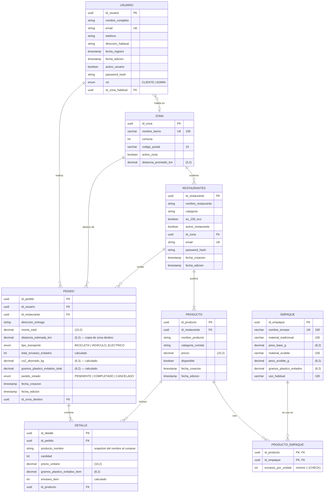

# Diagrama Entidad-Relación (DER) - EcoBite — S2

El esquema vivo vive en `backend/prisma/schema.prisma` (PostgreSQL + Prisma). Este documento es la referencia visual; mantener ambos en sync al cambiar el modelo.

Fuente de datos: Excel del Data Analyst `Tablas_Ecobite_V3_AlternativaB` (Alternativa B = tabla puente `Producto_Empaque`). Modalidad del equipo: **Delivery sustentable** (Zona + Producto + empaques eco), por eso no existe el modelo `Surplus`.

## Notas

- **Datos de referencia (seed)**: `pnpm --filter backend prisma:seed` carga los 48 barrios de CABA en `zona` y los 8 envases en `empaques` (idempotente). `distancia_promedio_km` = Haversine desde el Obelisco (-34.6037, -58.3816), mínimo 0.5 km. Restaurantes, productos y `producto_empaque` los provee el Data Analyst más adelante.
- **Autenticación**: los restaurantes inician sesión con su propia tabla (`email` + `password_hash`), por eso `rol` de usuario no incluye `COMERCIO`.
- **Enums**: `rol` (CLIENTE | ADMIN), `tipo_transporte` (BICICLETA | VEHICULO_ELECTRICO), `pedido_estado` (PENDIENTE | COMPLETADO | CANCELADO). Los KPIs filtran por `COMPLETADO`.
- **Texto libre (no enum)**: `restaurantes.categoria` y `producto.categoria_comida`.
- **`detalle.producto_nombre` y `precio_unitario`** son copias históricas: si el restaurante cambia el producto, el pedido sigue mostrando lo que se compró.

### Campos calculados (se guardan al crear el pedido)

Constante: `CO2_KG_POR_KM = 0.08`.

| Campo | Fórmula |
|---|---|
| `empaques.gramos_plastico_evitados` | `peso_base_g - peso_ecobite_g` |
| `detalle.envases_item` | `cantidad × SUM(envases_por_unidad)` del producto |
| `detalle.gramos_plastico_evitados_item` | `cantidad × SUM(envases_por_unidad × gramos_plastico_evitados)` |
| `pedidos.distancia_estimada_km` | copia de `zona.distancia_promedio_km` de la zona destino |
| `pedidos.co2_ahorrado_kg` | `distancia_estimada_km × 0.08` |
| `pedidos.total_envases_evitados` | `SUM(detalle.envases_item)` |
| `pedidos.gramos_plastico_evitados_total` | `SUM(detalle.gramos_plastico_evitados_item)` |
| `pedidos.monto_total` | `SUM(cantidad × precio_unitario)` (sin costo de envío por ahora) |

Ejemplo de control: Palermo (4.78 km) → `co2_ahorrado_kg = 0.382`.
